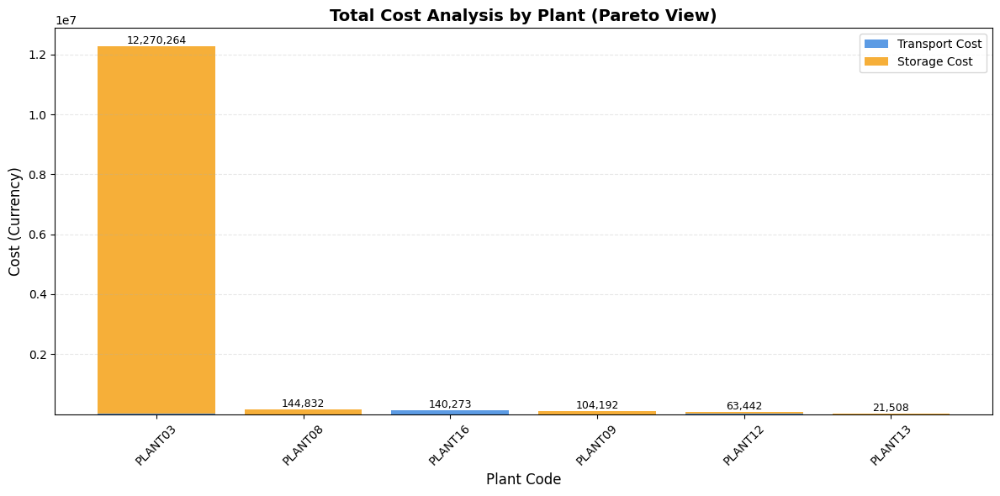
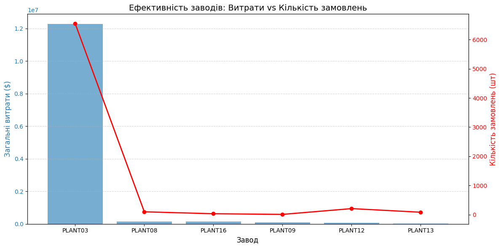
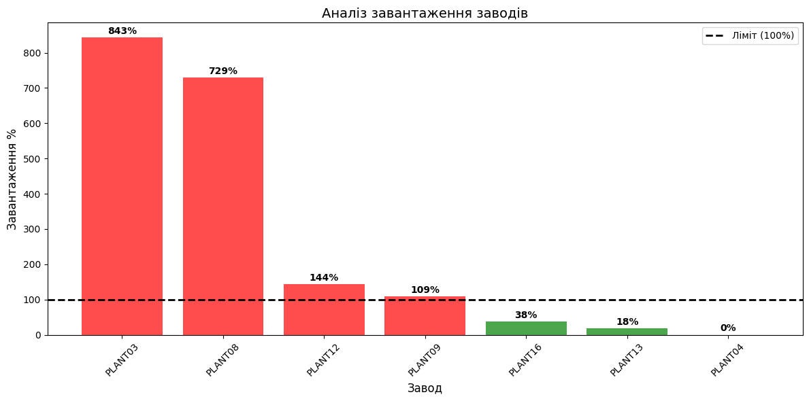
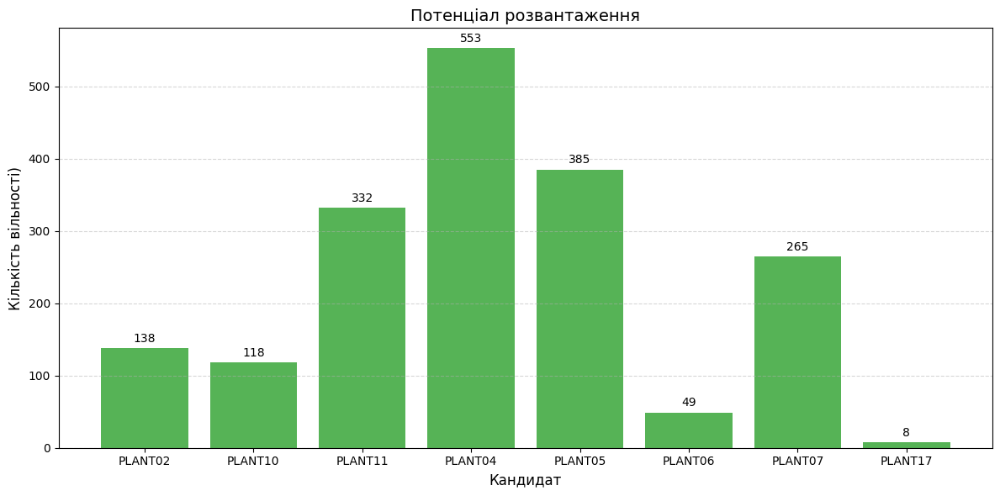

#SUPPLY CHAIN LOGISTIC ANALYSIS

## OVERVIEW
This dataset about ship logistics, movement, loading, costs.

## START
First, I decided to measure the consumption and saw a very strange distorted diagram. One circuit consumed the most.

Later, I discovered that this was due to the large number of orders and the expense involved.

## FINDING SOLUTION
Then I determined that there was a table with the maximum allowed number of accepted orders and data on actual orders. Three plents are overloaded.

I saw that not all factories were operating at full capacity and that they had potential for other orders. I identified the factories that manufacture the same products as PLENT03 and decided to calculate whether it was possible to balance the load.

The following was found: Available capacity for accepting orders: **1848**
Therefore, I decided to calculate the balance of potential unloading. It turned out to be negative, specifically **-5680.**

## CONCLUSION
Therefore, the balance is negative. It is not possible to unload the plant simply by evenly distributing the load. 

I have identified the following options:
a) Build new factories, which is the most optimal solution
b) Evenly distribute the influx of orders among the factories, which will help unload only the most overloaded factory 03, but overload the others, which is a bad solution
